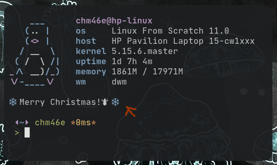

# Datify
Displays a small terminal notification for the special days.



### Features
* show today's message
* list all dates
* add/remove dates
* message color support
* test a specific date
* saves all dates to ~/.config/datify.db (sqldb)

### Dependencies
* <a href="https://sqlite.org/index.html">SQLite3</a> <3.36>
* gcc. make, etc..

### Install
```
> make
> sudo make install
```
Launch ```datify --help``` to get started!

### Colors
Can be done by inserting either <!color name!> or <*bold color*> to the message. The names are single characters.\
The special sequences get replaced with ansi codes. (ansi codes won't work directly due to a bug)
| Color  | Normal|
| ------ | ----- |
| Black  | <!a!> |
| Red    | <!r!> |
| Green  | <!g!> |
| Yellow | <!y!> |
| Blue   | <!b!> |
| Purple | <!p!> |
| Cyan   | <!c!> |
| White  | <!w!> |
| Clear  | <!x!> |

Bold colors can be achieved by replacing the exclamations with stars(*)\
for ex. ```<!r!>bloood<!x!>``` declares a red message as bloood

### Notes
There's really no input checking so the user is responsible for sane input.\
You can put whatever you'd like in the message, everything except direct ansi color codes works.\
I like to put ```datify``` into the fish startup script so it shows me today's message every time I open the terminal.\
Everything is stored in the datify.db file, so you can have all your dates there and they'll work on any system.

